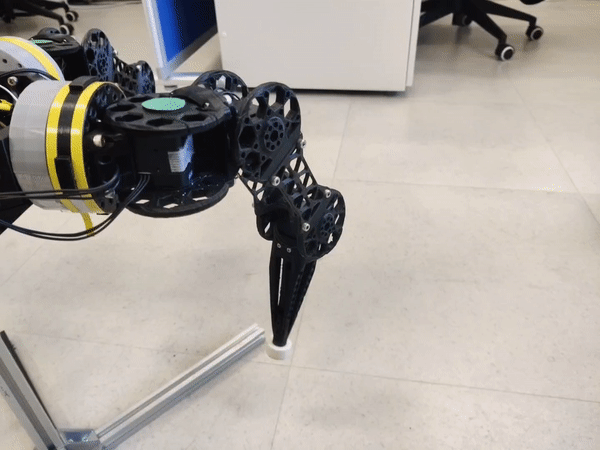

# ROS2 nodes and interfaces

To run those example ensure the robot is not automatically performing some movement from lvl5. Select what levels to launch using the arguments. Example: `ros2 launch motion_stack moonbot_zero.launch.py MS_up_to_level:=2`, this will launch levels 1 and 2.

#### NOTE
Ensure you sourced the workspace before running any of those commands: `source ~Motion-Stack/install/setup.bash`

## Level 01: Joint

#### IMPORTANT
This node’s Python code is meant to be specialized for your robot (through wrapping, overwriting, injecting …). Refer to [Lvl1 specialization API](api.md#lvl1-api-label) to change the interface.

Is the glue between the motion stack and lower levels like Rviz, simulation or real robot.
Its goal is to process joint states (sensor reading and motor commands).
Handled joints are decided based on the URDF and/or launch parameters. It can be responsible for only one joint, one leg, one robot or all joints it receives.

**Source code:**
: * Python: [`motion_stack.core.lvl1_joint`](../api/motion_stack/motion_stack.core.md#module-motion_stack.core.lvl1_joint)
  * Ros2 interface: [`motion_stack.ros2.base_node.lvl1`](../api/motion_stack/motion_stack.ros2.base_node.md#module-motion_stack.ros2.base_node.lvl1)
  * Ros2 default node: [`motion_stack.ros2.default_node.lvl1`](../api/motion_stack/motion_stack.ros2.default_node.md#module-motion_stack.ros2.default_node.lvl1)

**Topics:**
: * `joint_set` (**Input** from lvl2) `JointState`: Goal state for the joints
  * `joint_read` (**Output** to lvl2) `JointState`: Current state of the joints
  * `joint_commands` (**Output** to lvl0) `JointState`: Command sent to the motors
  * `joint_states` (**Input** from lvl0) `JointState`: Sensors reading of the joints

**Services:**
: * `advertise_joints` (**Output**) `ReturnJointState`: Returns the names (in the URDF) of all joints being handled by that node.
    (Additionally returns the latest state data, with nan if no data is available. However, this should not be used as a replacement to joint_read.)

```bash
# List all joints handled by leg1 using:
ros2 service call /leg1/advertise_joints motion_stack_msgs/srv/ReturnJointState
```

```bash
# Read the angles:
ros2 topic echo /leg1/joint_read
```

```bash
# Send an angle of 1 rad:
ros2 topic pub /leg1/joint_set sensor_msgs/msg/JointState "{name: [joint1_2], position: [1.0], velocity: [], effort: []}"
```


## Level 02: IK

This node loads the urdf to get all the kinematic information about its assigned leg.
It computes the IK of the given target and outputs the joint states toward lvl1.

**Source code:**
: * [`easy_robot_control.ik_heavy_node.IKNode`](../api/easy_robot_control/easy_robot_control.md#easy_robot_control.ik_heavy_node.IKNode)

Topics:
: - `set_ik_target` (**Input** from lvl3) `Transform`: Target command for the end effector of the leg. Relative to the body center (`base_link`). (If less than 6 DoF leg, quaternion data is ignored.)
  - `tip_pos` (**Output** to lvl3) `Transform`: Publishes the Transform of the leg’s end effector according to the joint angles reading.
  - `joint_set` (**Output** to lvl1) `JointState`: see lvl1
  - `joint_read` (**Input** from lvl1) `JointState`: see lvl1

```bash
# Send an IK target
ros2 topic pub /leg1/set_ik_target geometry_msgs/msg/Transform "{translation: {x: 400, y: 0, z: -100}, rotation: {x: 0.0, y: 0.0, z: 0.0, w: 1.0}}" -1
```

```bash
# Read the end effector position
ros2 topic echo /leg1/tip_pos
```



## Level 03: Leg

This node handles long running trajectories, outputing IK targets. It does not hold any dimension information.

Source code:
: * [`easy_robot_control.leg_node.LegNode`](../api/easy_robot_control/easy_robot_control.md#easy_robot_control.leg_node.LegNode)

Topics:
: - `tip_pos` (**Input** from lvl2) `Transform`: See lvl 02.
  - `set_ik_target` (**Output** to lvl2) `Transform`: See lvl 02.

Services:
: - `rel_transl` (**Input** from lvl4) `TFService`: Translates the tip of the leg linearly to the target. (Origin is base_link)
  - `shift` (**Input** from lvl4) `TFService`: Translates the tip of the leg linearly to the target. (Origin is current tip position, origin orientation is similar to *base_link*)
  - `rel_hop` (**Input** from lvl4) `TFService`: jumps the tip of the leg to the traget. Trajectory goes up, then moves above the target before going down onto the target. (Origin is base_link)
  - `rot` (**Input** from lvl4) `TFService`: Rotates the leg tip linearly, BUT !!! around the center specified by the TF. (Origin is base_link)
  - `tip_pos` (**Output** to lvl4) `ReturnVect3`: Returns the current position of the tip of the leg or the target if the tip is close to it. (Origin is *base_link*)

#### NOTE
Use `shift` to rotate the leg tip with the center of rotation being the leg tip.

```bash
# send a straight shift motion 100 mm upward
ros2 service call /leg1/shift motion_stack_msgs/srv/TFService "{tf: {translation: {x: 0, y: 0, z: 100}, rotation: {x: 0.0, y: 0.0, z: 0.0, w: 1.0}}}"
```

```bash
# requests the tip position
ros2 service call /leg1/tip_pos motion_stack_msgs/srv/ReturnVect3
```

Leg translation:
: 

Leg hopping:
: 

## Level 04: Mover

Synchronizes several legs.

Source code:
: * [`easy_robot_control.mover_node.MoverNode`](../api/easy_robot_control/easy_robot_control.md#easy_robot_control.mover_node.MoverNode)

Service:
: - `body_tfshift` (**Input** from lvl5) `TFService`: Translates the body by the given TF.
  - `get_targetset` (**Input** form lvl4s) `ReturnTargetSet`: Returns the current target set of the robot (list of ee coordinates)
  - `legX/rel_transl` `legX/shift` `legX/rel_hop`  `legX/rot` (**Output** to lvl4): Refer to lvl4
  - `legX/tip_pos` (**Input** from lvl4) `ReturnVect3`: Refer to lvl4.

```bash
cd ${ROS2_MOONBOT_WS}
. install/setup.bash
ros2 service call body_tfshift motion_stack_msgs/srv/TFService "{tf: {translation: {x: 0, y: 0, z: 100}, rotation: {x: 0.0, y: 0.0, z: 0.0, w: 1.0}}}"
ros2 service call body_tfshift motion_stack_msgs/srv/TFService "{tf: {translation: {x: 0, y: 0, z: -100}, rotation: {x: 0.0, y: 0.0, z: 0.0, w: 1.0}}}"
ros2 service call body_tfshift motion_stack_msgs/srv/TFService "{tf: {translation: {x: 0, y: 0, z: 100}, rotation: {x: 0.1, y: 0.0, z: 0.0, w: 1.0}}}"
ros2 service call body_tfshift motion_stack_msgs/srv/TFService "{tf: {translation: {x: 0, y: 0, z: 100}, rotation: {x: -0.1, y: 0.0, z: 0.0, w: 1.0}}}"
```

```bash
cd ${ROS2_MOONBOT_WS}
. install/setup.bash
ros2 service call /get_targetset motion_stack_msgs/srv/ReturnTargetSet
```

Body translation:
: 
