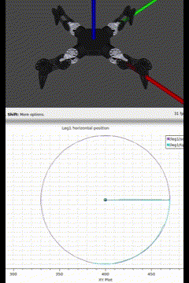
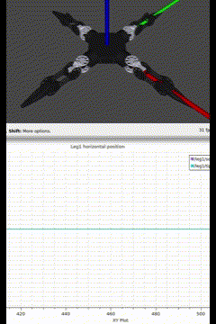
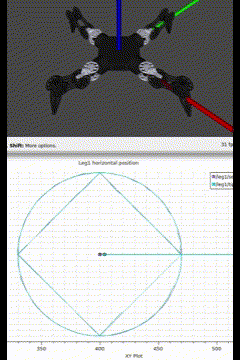
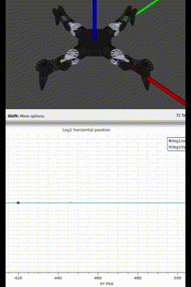

.. _api-label:
API
=======

I encourage you to dive into the source code and customize it to fit your robot’s unique needs. By importing the motion stack Python API into your own package and nodes, you keep customizations separate from the *core* motion stack while adapting it to each of your robot or robot module.

In this section, I’ll walk you through an example: creating a package to launch the Moonbot Zero with a different architecture and modifying the behavior of the nodes.

.. _api-pkg:
Make your package
-----------------

.. Note::
    Source ros2 before all those commands.

.. Important::
   This tutorial utilizes ``~/Motion-Stack/`` as workspace. This is not required, you have 3 different way to use the Motion-Stack: 

    - Use ``~/Motion-Stack/`` as your workspace. Easiest, because you have direct access to the build tools (and python virtual environment) provided by the Motion-Stack.
    - Build and source ``~/Motion-Stack/install/setup.sh`` before building your workspace. Build tools are still available, but NOT for your workspace, only to build the Motion-Stack.
    - Copy/symlink ``~/Motion-Stack/src/`` inside your workspace ``src`` folder. Build tools unavailable, you have to colcon build and handle the venv yourself.

    If you are not using a venv, all 3 points are easy and which is best depends on your project(s). 

    If using a venv (only for ros2 jazzy) and the api, you need to create and activate the proper venv, before using colcon from the venv (:ref:`install-venv`). You might find method 1 easier to let the motion_stack handle the venv.

Go in your workspace's source:

.. code-block:: bash

    cd ~/Motion-Stack/src/

Create a package with a node named lvl1:

.. code-block:: bash

    ros2 pkg create --build-type ament_python --node-name lvl1 moonbot_zero

Open ``src/moonbot_zero/setup.py`` and change it like below. This will make available in the share sirectory:

    - All your .launch.py files in ``launch/`` , so ros2 can find them.
    - All your meshes/ and urdf/ available

.. code-block:: python
    :emphasize-lines: 2, 11
    :linenos:

    from setuptools import find_packages, setup
    from glob import glob # add this line

    package_name = 'moonbot_zero'

    setup(
        name=package_name,
        version='0.0.0',
        packages=find_packages(exclude=['test']),
        data_files=[
            (f"share/{package_name}/launch", glob("launch/*.py")),
            ('share/ament_index/resource_index/packages',
                ['resource/' + package_name]),
            ('share/' + package_name, ['package.xml']),
            ...

Create your own launcher in ``launch/`` of your new package:

.. code-block:: bash

    cd ~/Motion-Stack/src/moonbot_zero
    mkdir launch
    cd launch
    touch myrobot.launch.py

.. Note::

    For the provided executable to launch your new launcher, change ``~/Motion-Stack/launch_stack.bash`` like so:

    .. code-block:: bash

        ...
        ros2 launch moonbot_zero myrobot.launch.py MS_up_to_level:=4

    You can then launch and see your changes with ``bash launch_stack.bash``:

Using your URDF
---------------

Making a URDF available from your custom package
^^^^^^^^^^^^^^^^^^^^^^^^^^^^^^^^^^^^^^^^^^^^^^^^

In a ros package (here named *moonbot_zero*), create a ``urdf/`` and ``meshes/`` directories, then place you urdfs and meshes inside.

.. code-block:: bash

    cd ~/Motion-Stack/src/moonbot_zero
    mkdir meshes
    mkdir urdf

Make those directories available in the package shared directory by changing the ``setup.py``

.. code-block:: python
    :emphasize-lines: 9-10
    :linenos:

    ...

    setup(
        name=package_name,
        version='0.0.0',
        packages=find_packages(exclude=['test']),
        data_files=[
            (f"share/{package_name}/launch", glob("launch/*.py")),
            (f"share/{package_name}/urdf", glob("urdf/*", recursive=True)), # (this)
            (f"share/{package_name}/meshes", glob("meshes/*", recursive=True)), # (this)
            ]
        )

Make sure to adjust the paths of the urdf. ``<mesh filename="{SOMETHING}/base_link.stl" />`` should be ``<mesh filename="package://moonbot_zero/meshes/base_link.stl" />`` (where *moonbot_zero* is the name of the package).

Loading your URDF
^^^^^^^^^^^^^^^^^

Using the launch API in the next section, you can load a URDF by providing the package name and path. Assuming the package is *moonbot_zero* and the URDF is inside ``urdf/moonbot_zero.xacro``:

.. code-block:: python

    urdf_path=xacro_path_from_pkg(
        package_name="moonbot_zero",
        xacro_path="urdf/moonbot_zero.xacro",
    )

.. _launch-api-label:

Launch API
----------

To streamline the creation of numerous nodes, the :py:mod:`motion_stack.api.launch` provides a python launch API -- essentially wrapping around ROS2's launch system. The class :py:class:`.api.launch.builder.LevelBuilder` creates the nodes to be launched and its ultimate method :py:meth:`.api.launch.builder.LevelBuilder.make_description` returns the launch description used by ROS2.

Warming up
^^^^^^^^^^

Edit your ``myrobot.launch.py`` and let us start with the default launch provided by the motion stack:

.. code-block:: python

    from motion_stack.api.launch.builder import (
        LevelBuilder,
        xacro_path_from_pkg,
    )

    ROBOT_NAME = "moonbot_7"

    LEGS_DIC = {
        1: "end1",
        2: "end2",
        3: "end3",
        4: "end4",
    }

    lvl_builder = LevelBuilder(
        urdf_path=xacro_path_from_pkg(
            package_name="moonbot_zero", xacro_path="urdf/moonbot_zero.xacro"
        ),
        leg_dict=LEGS_DIC,
    )

    def generate_launch_description():
        return lvl_builder.make_description()

Changing params
^^^^^^^^^^^^^^^

.. code-block:: python

    ...
    new_params = {
        "std_movement_time": 10.0,
    }

    lvl_builder = LevelBuilder(
        urdf_path=xacro_path_from_pkg(
            package_name="moonbot_zero", xacro_path="urdf/moonbot_zero.xacro"
        ),
        leg_dict=LEGS_DIC,
        params_overwrite=new_params,
    )
    ...

After overwriting the ``std_movement_time`` parameter with 10 by passing it to the :py:class:`.LevelBuilder`, movements are very slow:

.. code-block:: bash

    ros2 service call /leg1/shift motion_stack_msgs/srv/TFService "{tf: {translation: {x: -100, y: 0, z: -100}, rotation: {x: 0.0, y: 0.0, z: 0.0, w: 1.0}}}"

Changing end effector and leg numbers
^^^^^^^^^^^^^^^^^^^^^^^^^^^^^^^^^^^^^

.. code-block:: python

    ...
    LEGS_DIC = {
        1: "end2",
        2: "end1",
        3: "end3",
        40: "end4",
    }
    ...

After changing the ``LEGS_DIC`` dictionary specifying which end effector correspond to each leg and passing it to :py:class:`.LevelBuilder`, leg2 is now the one at the front.

.. code-block:: bash

    ros2 service call /leg2/shift motion_stack_msgs/srv/TFService "{tf: {translation: {x: -100, y: 0, z: -100}, rotation: {x: 0.0, y: 0.0, z: 0.0, w: 1.0}}}"

And leg 40 is the one on the right:

.. code-block:: bash

    ros2 service call /leg40/shift motion_stack_msgs/srv/TFService "{tf: {translation: {x: 20, y: 50, z: -50}, rotation: {x: 0.0, y: 0.0, z: 0.0, w: 1.0}}}"

.. Note::

    Revert this back when you are done, otherwise you might get confused going further.

    .. code-block:: python

        LEGS_DIC = {1: "end1", 2: "end2", 3: "end3", 4: "end4"}

Overloading to have a single robot_state_publisher
^^^^^^^^^^^^^^^^^^^^^^^^^^^^^^^^^^^^^^^^^^^^^^^^^^

Looking at the default launching behavior, each leg has it own state publisher. This has limited usefulness for our Moobot Zero because this robot makes use of one centralized computer and not one computer per leg.

Let's change :py:meth:`.api.launch.LevelBuilder.state_publisher_lvl1` to centralize the state publishers in global namespace. Comparing below with the original source code, not much changed aside from one loop and a remapping.

.. code-block:: python

    ...
    from typing import Any, Dict, List, Mapping, Union
    from launch_ros.actions import Node
    from launch_ros.parameter_descriptions import ParameterValue
    from motion_stack.api.launch.builder import LevelBuilder, xacro_path_from_pkg
    from launch.substitutions import Command

    class MyLevelBuilder(LevelBuilder):
        def state_publisher_lvl1(self) -> List[Node]:
            compiled_xacro = Command([f"xacro ", self.xacro_path])
            node_list = []
            leg_namespaces = [f"leg{param['leg_number']}" for param in self.lvl1_params()]
            all_joint_read_topics = [f"{ns}/joint_read" for ns in leg_namespaces]
            node_list.append(
                Node(
                    package=self.MS_PACKAGE,
                    executable="lazy_joint_state_publisher",
                    name="lazy_joint_state_publisher",
                    # namespace=ns,
                    arguments=["--ros-args", "--log-level", "warn"],
                    parameters=[
                        {
                            "source_list": all_joint_read_topics,
                            "publish_default_positions": True,
                        }
                    ],
                    remappings=[
                        # (intside node, outside node),
                        ("joint_states", "continuous_joint_read"),
                    ],
                ),
            )
            node_list.append(
                Node(
                    package="robot_state_publisher",
                    executable="robot_state_publisher",
                    name="robot_state_publisher",
                    # namespace=ns,
                    arguments=["--ros-args", "--log-level", "warn"],
                    parameters=[
                        {
                            "robot_description": ParameterValue(
                                compiled_xacro, value_type=str
                            ),
                        }
                    ],
                    remappings=[
                        # (intside node, outside node),
                        ("joint_states", "continuous_joint_read"),
                    ],
                ),
            )
            return node_list
    ...

We created a new class ``MyLevelBuilder`` that inherits the behavior of ``LevelBuilder`` and overwrites the one method ``state_publisher_lvl1``. Now, when ``self.state_publisher_lvl1`` is called, one ``joint_state_publisher`` and ``robot_state_publisher`` is created in the global namespace listening to the list of topics ``[leg1/joint_read, leg2/joint_read, ...]``.

.. Note::

     \ ``lazy_joint_state_publisher`` is used, it is slightly different from the default ``joint_state_publisher``. See :py:class:`motion_stack.ros2.utils.lazy_joint_state_publisher.LazyJointStatePublisher`

Remapping
^^^^^^^^^

Notice in the previous example, "joint_states" topic is used differently by several nodes. They need to be remapped onto other name to avoid conflicts:

.. code-block:: python

    ...
        remappings=[
            # (intside node, outside node),
            ("joint_states", "continuous_joint_read"),
        ],
    ...

.. Note::

    Remapping and namespaces are the main way to avoid conflicts when building your modular system.

Automating modularity
^^^^^^^^^^^^^^^^^^^^^

Using python you can change the behavior of your launcher depending on where it is launch (on the robot brain, on leg #1, on leg #2, on any PC, on ground station, ...). There is no one good way to do it, so I will explain my method with a very basic example:

I define environment variables in the OS of the computer, then launch different nodes base on that. Again, overwrite :py:meth:`.api.launch.LevelBuilder.state_publisher_lvl1` to add such functionalities.

.. code-block:: python

    class MyLevelBuilder(LevelBuilder):
        def __init__(
            self,
            urdf_path: str,
            leg_dict: Mapping[int, Union[str, int]],
            params_overwrite: Dict[str, Any] = dict(),
            urdf: Union[None, str, Command] = None,
        ):
            # gets the "COMPUTER_ID" environement variable
            self.COMPUTER_ID = os.environ.get("COMPUTER_ID")
            if self.COMPUTER_ID in ["leg1", "leg2", "leg3", "leg4"]:
                # if running on one of the leg computer
                # we only start the assiciated leg/end-effector
                leg_number = int(self.COMPUTER_ID[-1])
                end_effector: Union[str, int, None] = leg_dict.get(leg_number)
                if end_effector is None:
                    raise Exception("leg number has no entry in leg_dict")
                reduced_leg_dict = {leg_number: end_effector}
                leg_dict = reduced_leg_dict
            super().__init__(urdf_path, leg_dict, params_overwrite, urdf)

        def make_levels(self) -> List[List[Node]]:
            if self.COMPUTER_ID in ["leg1", "leg2", "leg3", "leg4"]:
                # if running on one of the leg computer
                # we only start lvl1
                return [self.lvl1()]
            if self.COMPUTER_ID == "robot_brain":
                # if running on the main robot computer
                # we start lvl2-3-4
                return [self.lvl2(), self.lvl3(), self.lvl4()]
            if self.COMPUTER_ID == "ground_station":
                # if running on the ground station
                # we start only lvl5
                return [self.lvl5()]
            # if none of the previous cases, the default behavior runs everything
            return super().make_levels()

.. Note::

   This is not part of the tutorial, you do not need to make this work.

.. _own-node-label:

Loading you own node
^^^^^^^^^^^^^^^^^^^^

In the next section we will replace the default motion stack lvl1 node :py:class:`motion_stack.ros2.default_node.lvl1.DefaultLvl1` with our own modified node, from our package. We will make the launch API load our node instead of the default.

In your launcher overload :py:meth:`.LevelBuilder.get_node_lvl1` with:

.. code-block:: python
    :emphasize-lines: 5-8

    class MyLevelBuilder(LevelBuilder):
        def get_node_lvl1(self, params: Dict[str, Any]) -> Node:
            ns = f"leg{params['leg_number']}"
            return Node(
                package="moonbot_zero",
                namespace=ns,
                executable="lvl1",
                name=f"lvl1",
                arguments=["--ros-args", "--log-level", "info"],
                emulate_tty=True,
                output="screen",
                parameters=[params],
                remappings=self.remaplvl1,
            )

.. _lvl1-api-label:

Lvl1 specialization API
-----------------------

The Motion Stack low level python code is designed such that you can easily overload relevant part of the code and use it like an API in which you inject your code.

.. Note::

    After completing the previous step ":ref:`own-node-label`", modify your node ``src/moonbot_zero/moonbot_zero/lvl1.py``.

Overwriting
^^^^^^^^^^^

By importing the motion stack default node of lvl1 :py:class:`motion_stack.ros2.default_node.lvl1`, you can overwrite parts of it with the code you need.

The following example python file:
    - Overwrite :py:class:`.lvl1.DefaultLvl1`\ ``.__init__()`` to add a timer and publisher
    - Makes a new callback for the timer, moving each joint in a sinusoidal motion (this emulates a subscriber or something receiving data).
    - Overwrites :py:meth:`.DefaultLvl1.publish_to_lvl0`, it now also publishes every command on a string topic ``display_angle_command``.

.. literalinclude:: ../../../src/moonbot_zero_tuto/moonbot_zero_tuto/lvl1.py
   :linenos:
   :lines: 1-24, 42-
   :language: python

You can now listen to the motor commands of leg1 using:

.. code-block:: bash

   ros2 topic echo /leg1/display_angle_command

.. code-block:: console

   data: 'leg 1
      lvl1 -> lvl0: joint1_1 | 5.7
      lvl1 -> lvl0: joint1_2 | 5.7
      lvl1 -> lvl0: joint1_3 | 5.7'

Using the API and overloading like this, you can easily add functionalities to the motion stack without creating a new whole node, and with minimal knowledge of ros2. You can:

    - Change where the data is sent and how it is formatted (like we did with the string topic).
    - Change where the data comes from and its format (like we did with the timer, you can replace it with a subscriber).

Injection
^^^^^^^^^

Injection consists in instantiating an object that adds functionalities to a parent object.
Right now a few ready to use injections are available in :py:mod:`motion_stack.api.ros2` (their non-ros dependent and general injections are in :py:mod:`motion_stack.api.injection`).

    - :py:mod:`motion_stack.api.injection.remapper` : Remaps states names, and applies shaping functions to the state data. With this you can apply offsets, gains and more. (does not require ros)
    - :py:mod:`motion_stack.api.ros2.offsetter` : Adds angle offsets to the motor output of lvl1 at runtime (and a little bit more)
    - :py:mod:`motion_stack.api.ros2.state_to_topic` : Publishes on individual Float64 topics instead of a JointStates topic.

Let's use all 3\:

.. literalinclude:: ../../../src/moonbot_zero_tuto/moonbot_zero_tuto/lvl1.py
   :linenos:
   :emphasize-lines: 25-41
   :language: python

Running ``ros2 topic echo /leg1/display_angle_command`` you'll see that ``joint1-1`` is now ``my-new-joint``, and its value has been multiplied by 2.

.. code-block:: bash

    ros2 topic echo /leg1/display_angle_command

.. code-block:: console
   :emphasize-lines: 2

   data: 'leg 1
      lvl1 -> lvl0: my_new_joint | 11.4
      lvl1 -> lvl0: joint1_2 | 5.7
      lvl1 -> lvl0: joint1_3 | 5.7'

Running  ``ros2 topic list | grep .*/driver`` you'll see that topics have been created, publishing the positions of the joints.

.. code-block:: bash

    ros2 topic list | grep .*/driver

.. code-block:: console

    /leg1/driver/joint1_2/position
    /leg1/driver/joint1_3/position
    /leg1/driver/my_new_joint/position
    /leg2/driver/joint2_1/position
    /leg2/driver/joint2_2/position
    /leg2/driver/joint2_3/position
    /leg3/driver/joint3_1/position
    /leg3/driver/joint3_2/position
    /leg3/driver/joint3_3/position
    /leg4/driver/joint4_1/position
    /leg4/driver/joint4_2/position
    /leg4/driver/joint4_3/position

Running the code below, will add 1 radian to the output of joint1-2 (not in rviz, only on the lvl0 motor command output).

.. code-block:: bash

    ros2 service call /leg1/set_offset motion_stack_msgs/srv/SendJointState "{js: {name: [joint1_2], position: [1], velocity: [], effort: []}}"

.. code-block:: console
   :emphasize-lines: 3

   data: 'leg 1
      lvl1 -> lvl0: my_new_joint | -1.4
      lvl1 -> lvl0: joint1_2 | -58.0
      lvl1 -> lvl0: joint1_3 | -0.7'

.. _high-api-label:
High level API
--------------

.. Warning::

   This tutorial section is not finished, the in-code documentation is however available: :py:mod:`motion_stack.api.ros2`

High level APIs are available and meant to be used by the user while also being used throughout the source-code. The API abstracts away the communication layer (ROS2 or else) allowing for complex functionalities, minimal boilerplate and tailor-made solutions.

 - Joint API -- :py:mod:`.api.ros2.joint_api`: Python API for joint control.
  
  - Joint Handler -- :py:class:`.api.ros2.joint_api.JointHandler`: Handles the joint state of a single limb (send, receive, list joint names, joints ready...).
  - Joint Syncer -- :py:class:`.api.ros2.joint_api.JointSyncerRos`: Synchronizes and interpolates the movement of several joints (one or several limbs).
 - IK API -- :py:mod:`.api.ros2.joint_api`: Python API for IK control.
  
  - IK Handler -- :py:class:`.api.ros2.ik_api.IkHandler`: Handles the state of a single end-effector (send, receive, ready...).
  - IK Syncer -- :py:class:`.api.ros2.ik_api.IkSyncerRos`: Synchronizes and interpolates the movement of end-effectors (one or several limbs).

.. image:: ../media/apidemo_circle.gif

An example node using the high level API, doing some movements using the moonbot zero is available in ``src/moonbot_zero_tuto/moonbot_zero_tuto/high_level.py``. This node is specific to moonbot zero, however the APIs used are not. This section will break down this code, please take inspiration from it.

Warming up
^^^^^^^^^^^^^^^^^^^^^^^^^^^^^

First refer to :ref:`api-pkg` and `Ros2 Documentation <https://docs.ros.org/en/humble/Tutorials/Beginner-Client-Libraries.html>`_ to create a package with an (additional) node.

Our new node's code is in ``src/moonbot_zero_tuto/moonbot_zero_tuto/high_level.py``, and we add the assiciated entry-point in ``~/Motion-Stack/src/moonbot_zero_tuto/setup.py``.

.. code-block:: python
    :emphasize-lines: 4

    entry_points={
        "console_scripts": [
            "lvl1 = moonbot_zero_tuto.lvl1:main",
            "high_level = moonbot_zero_tuto.high_level:main",
            ...

Let's import everything we need and create an empty ROS2 node.

.. Important::
    In this example, I will use python's native async capabilities through the ros2 executor. It is kind of a hack to avoid ROS2's Future-Callback and thus: reduce boilerplate, improve code readability. The goal of this section is to explain the API, not to explain Future-Callbacks, therefor I chose asyncio, but your application does not need to (and maybe should not, in favor of ROS2's more efficient Callbacks).

.. code-block:: python

    from typing import Coroutine

    import numpy as np
    from rclpy.node import Node

    pass
    import motion_stack.ros2.ros2_asyncio.ros2_asyncio as rao
    from motion_stack.api.ik_syncer import XyzQuat
    from motion_stack.api.ros2.ik_api import IkHandler, IkSyncerRos
    from motion_stack.api.ros2.joint_api import JointHandler, JointSyncerRos
    from motion_stack.core.utils.math import patch_numpy_display_light, qt
    from motion_stack.core.utils.pose import Pose
    from motion_stack.ros2.utils.conversion import ros_now
    from motion_stack.ros2.utils.executor import error_catcher, my_main

    # lighter numpy display
    patch_numpy_display_light()

    x = 400
    z = -100
    DEFAULT_STANCE = np.array(
        [
            [x, 0, z], # leg 1
            [0, x, z], # leg 2
            [-x, 0, z], # leg 3
            [0, -x, z], # leg 4
        ],
        dtype=float,
    )

    class TutoNode(Node):

        #: list of limbs number that are controlled
        LIMBS = [1, 2, 3, 4]

        def __init__(self) -> None:
            super().__init__("test_node")
            ...

    def main(*args):
        my_main(TutoNode)

Analyze the code:

 - First notice how almost no information about the robot is necessary. Those are handled by the other ROS2 nodes of lvl1 and lvl2, we only need to interface with those. Someone else from your team can be in charge of those levels and not impact your work.
 - ``DEFAULT_STANCE`` is an array of end effector positions, for the 4 limbs of the Moonbot Zero. Those are used to place the robot in the default 'stand up' configuration using IK.
 - ``class TutoNode(Node):`` is a standard empty ROS2 node named "test_node"
 - ``TutoNode.LIMBS:`` stores the limb numbers that we will control. Those correspond to what we set in our launch file (:ref:`launch-api-label`) and therefor the limb number of the lvl1 and lvl2 nodes. Those could be other numbers, possibly in different order if you are using multiple or modular robots.
 - :py:func:`.patch_numpy_display_light` is a convenience function reducing the number of floating points digits printed by numpy arrays.
 - :py:func:`.my_main` is a convenience function spinning a ROS2 node with additional error handling.

 .. code-block:: python
    :caption: Limb dictionary used by our launch file.
    
    LEGS_DIC = {
        1: "end1",
        2: "end2",
        3: "end3",
        4: "end4",
    }

Create the handlers and syncers
^^^^^^^^^^^^^^^^^^^^^^^^^^^^^^^^^^

.. code-block:: python

    ...
    class TutoNode(Node):

        #: list of limbs number that are controlled
        LIMBS = [1, 2, 3, 4]

        def __init__(self) -> None:
            super().__init__("test_node")

            self.create_timer(1 / 30, self.exec_loop)  # regular execution
            self.startTMR = self.create_timer(0.1, self.startup)  # executed once

            # API objects:

            # Handles ros2 joints lvl1 (subscribers, publishers and more)
            self.joint_handlers = [JointHandler(self, l) for l in self.LIMBS]
            # Syncronises several joints
            self.joint_syncer = JointSyncerRos(self.joint_handlers)

            # Handles ros2 ik lvl2
            self.ik_handlers = [IkHandler(self, l) for l in self.LIMBS]
            # Syncronises several IK
            self.ik_syncer = IkSyncerRos(
                self.ik_handlers,
                interpolation_delta=XyzQuat(20, np.inf),
                on_target_delta=XyzQuat(2, np.inf),
            )

            self.get_logger().info("init done")
            ...

        @error_catcher
        async def main(self):
            ...

        @error_catcher
        def startup(self):
            """Execute once at startup"""
            # Ros2 will executor will handle main()
            rao.ensure_future(self, self.main())

            # destroys timer
            self.destroy_timer(self.startTMR)
            print("Startup done.")

        @error_catcher
        def exec_loop(self):
            """Regularly executes the syncers"""
            self.joint_syncer.execute()
            self.ik_syncer.execute()
    ...

Analyze the code:

 - ``self.create_timer(1 / 30, self.exec_loop)`` with ``.exec_loop()`` regularly executes the api (syncers in this case). You the user are in charge of timing and execution. This stems from the fact that the Motion-Stack core has no ROS2 dependencies. The core can be use anywhere, delegating it's (background) execution to the user's implementation (here ROS2).
 - ``self.startTMR`` is a single shot timer whose callback ``.startup()`` is executed once. Then ``rao.ensure_future(self, self.main())`` lets the ros2 executor handle ``self.main()`` as a python async function. This one-shot timer is critically different from the ``.__init__()`` because ``.__init__()`` runs before the node spins, whereas this one-shot is executed by the ROS2 executor after the node starts spinning.
 - ``@`` :py:class:`motion_stack.ros2.utils.executor.error_catcher` is a convenience decorator intercepting errors in ROS2 callbacks that are often silenced by the executor.
 - ``self.joint_handlers`` is a list containing :py:class:`.ros2.joint_api.JointHandler` objects associated with each limb in ``LIMBS``. Those objects supervise the joints states of ONE limb. They are basically the interface to lvl1 (joint node).
 - ``self.joint_syncer`` is one :py:class:`.ros2.joint_api.JointSyncerRos` object. This objects synchronizes long-running trajectories of multiple joints over multiple limbs. It takes a list of JointHandler as argument, because a handler is limited to one limb, but a syncer spans multiple limbs.
 - ``self.ik_handlers`` is a list containing :py:class:`.ros2.joint_api.IkHandler` objects associated with each limb in ``LIMBS``. Those objects supervise the end-effector states of ONE limb. They are basically the interface to lvl2 (ik node).
 - ``self.ik_syncer`` is one :py:class:`.ros2.joint_api.IkSyncerRos` object. This objects synchronizes long-running trajectories of multiple end-effectors over multiple limbs. It takes a list of IkHandler as argument, because a handler is limited to one limb, but a syncer spans multiple limbs.

 .. Important::

    The Syncers use delta values, those are quite complex. Think of it as the the maximum allowed error before slowing down the movement. Yes, you do not need to specify the movement speed, this is a very powerfull feature making the Motion-Stack robot agnostic. The syncer will adapt on the fly to the robot response. Increasing the delta will make the robot less careful and faster.

    Related to this, the delta for the ik is ``XyzQuat(20, np.inf)``, so 20mm of leeway over xyz and an infinite rotational error. Rotational delta is infinite because the Moobot Zero lacks DoF to control its end-effector rotation.

Waiting for the ready state
^^^^^^^^^^^^^^^^^^^^^^^^^^^^^^^^

Because of the async and distributed nature of the system, we need to wait for all data and systems to be ready. We cannot execute the motion if joint states are missing, or worse node s are missing. So our first step in ``.main()`` is to wait our handlers to be ready.

.. code-block:: python

    ...
    @error_catcher
    async def main(self):
        # wait for all handlers to be ready
        await self.joints_ready()
        await self.ik_ready()
        ...

    async def joints_ready(self):
        """Returns once all joints are ready"""
        ready_tasks = [jh.ready for jh in self.joint_handlers]
        try:
            print("Waiting for joints.")
            fused_task = rao.gather(self, *ready_tasks)
            await rao.wait_for(self, fused_task, timeout_sec=100)
            print(f"Joints ready.")
            strlist = "\n".join(
                [f"limb {jh.limb_number}: {jh.tracked}" for jh in self.joint_handlers]
            )
            print(f"Joints are:\n{strlist}")
            return
        except TimeoutError:
            raise TimeoutError("Joint data unavailable after 100 sec")

    async def ik_ready(self):
        """Returns once all ik are ready"""
        ready_tasks = [ih.ready for ih in self.ik_handlers]
        try:
            print("Waiting for ik.")
            fused_task = rao.gather(self, *ready_tasks)
            await rao.wait_for(self, fused_task, timeout_sec=100)
            print(f"Ik ready.")
            strlist = "\n".join(
                [f"limb {ih.limb_number}: {ih.ee_pose}" for ih in self.ik_handlers]
            )
            print(f"EE poses are:\n{strlist}")
            return
        except TimeoutError:
            raise TimeoutError("Ik data unavailable after 100 sec")
    ...

Analyze the code:

 - Python's ``await`` keyword on a Coroutine (async function) waits for the coroutine's completion, before continuing onto the next line of code. Because of our startup sequence, the ROS2 executor will handle this without blocking other ROS2 processes (incoming messages, callbacks...).
 - Both ik and joint, handlers have the same ``.ready`` implementation. It is a Future that is ``done`` when data is available on all end-effectors/joints.
 - ``ready_tasks = [ih.ready for ih in self.ik_handlers]`` makes a list of all those Futures, because there is one Future per limb.
 - ``fused_task = rao.gather(self, *ready_tasks)`` gathers all those Futures as a single one. When all are ``done``, the ``fused_task`` will be considered ``done``.
 - ``await rao.wait_for(self, fused_task, timeout_sec=100)`` waits for the fused task (all Futures) to be ``done`` before continuing execution. Next line will be executed when the ik/joint handlers are all ready, if it takes more than 100 seconds, TimeoutError will be raised.
 - ``strlist`` extracts info to display, if the handlers were not ready, the data could be incomplete:

   - ``<handler>.limb_number``: limb number of the handler.
   - :py:attr:`.ros2.joint_api.JointHandler.tracked`: Set of joint names available on the limb.
   - :py:attr:`.ros2.ik_api.IkHandler.ee_pose`: Most recent end-effector pose (:py:class:`.core.utils.pose.Pose`).

.. Note::
    :py:attr:`.ros2.ik_api.IkHandler.ready` is a ROS2 Future, not a python Awaitable (I am going to be very happy the day ROS2 Future's become compatible with python's native Awaitable). ``rao`` allows us to convert and await a ROS2 Future. 

Sending all joints to zero
^^^^^^^^^^^^^^^^^^^^^^^^^^^^^^

Now that our handlers are ready and we know the names of our joints. Let's use the syncer to send all of our joints to the angle of 0.

.. code-block:: python

    @error_catcher
    async def main(self):
        # wait for all handlers to be ready
        await self.joints_ready()
        await self.ik_ready()

        # send to all angle at 0.0
        await self.angles_to_zero()

    def angles_to_zero(self) -> Coroutine:
        """sends all joints to 0.0"""
        target = {}
        for jh in self.joint_handlers:
            target.update({jname: 0.0 for jname in jh.tracked})

        task = self.joint_syncer.asap(target)
        return rao.wait_for(self, task, timeout_sec=100)

Analyze the code:

 - ``await self.angles_to_zero()`` will be executed after the ``await <...>_ready()``.
 - ``def angles_to_zero(self) -> Coroutine:`` is not an async function, but returns a Awaitable Coroutine. Think of it as equivalent to returning an async function, then ``await`` will handle it.
 - ``target = {}`` creates an empty dictionary that will contain the targets associated with all our joints. :py:meth:`.JointSyncer.asap` specifies that this should be a ``Dict[str, float]``.
 - ``for jh in self.joint_handlers: <...> target.update(<...>)`` adds entries to the dictionary for the joint handlers of each limbs.
 - ``{jname: 0.0 for jname in jh.tracked}`` for every joint name stored in :py:attr:`.ros2.joint_api.JointHandler.tracked` creates an entry in the dictionary with the value ``0.0``.
 - ``task = self.joint_syncer.asap(target)`` calls :py:meth:`.JointSyncer.asap` with our target. It returns a Future representing the movement's task, we can await it using ``rao``. The long-running movement task itself is executed 'in the background' when our ``.exec_loop`` method calls :py:meth:`.JointSyncer.execute`.

.. Note::
    
    Several interpolation strategies to reach the target are available:

     - LERP: :py:meth:`.JointSyncer.lerp`: All joints reach the target at the same time.
     - ASAP: :py:meth:`.JointSyncer.asap`: Joints will reach their tagets indepently, as fast as possible
     - Unsafe: :py:meth:`.JointSyncer.unsafe`: Similar to ASAP except the final target is sent directly to the motor, so the movement will not stop in case of crash, errors, network issue AND you cannot cancel it.
     - Speed safe: :py:meth:`.JointSyncer.speed_safe`: Moves the joints at a given set speed and keeps them in sync position-wise.

Using Ik to reach the default stance
^^^^^^^^^^^^^^^^^^^^^^^^^^^^^^^^^^^^^^^^^^^

.. code-block:: python

    async def main(self):
        # wait for all handlers to be ready
        await self.joints_ready()
        await self.ik_ready()

        # send to all angle at 0.0
        await self.angles_to_zero()
        # send to default stance
        await self.stance()

    def stance(self) -> Coroutine:
        """Goes to the default moonbot zero stance using IK"""
        target = {
            leg_num: Pose(
                time=ros_now(self),
                xyz=DEFAULT_STANCE[leg_num - 1, :],
                quat=qt.one,
            )
            for leg_num in self.LIMBS
        }
        task = self.ik_syncer.lerp(target)
        return rao.wait_for(self, task, timeout_sec=100)

Analyze the code:

 - ``target`` is now a dictionary of limb numbers associated with a pose (:py:class:`.pose.Pose`). The pose is created from our DEFAULT_STANCE array defined at the beginning. See the code-block below for the values in the dictionary.
 - The use of task, Future and ik syncer is identical to previous joint control section. Except here :py:meth:`.IkSyncer.lerp` interpolation method is used.

.. code-block:: python
    :caption: Values in the target dictionary

    target = {
        # {<Leg number>: <End-Effector pose>}
        1: Pose(time=now, xyz=[400, 0, -100], quat=[1,0,0,0]),
        2: Pose(time=now, xyz=[0, 400, -100], quat=[1,0,0,0]),
        3: Pose(time=now, xyz=[-400, 0, -100], quat=[1,0,0,0]),
        4: Pose(time=now, xyz=[0, -400, -100], quat=[1,0,0,0]),
    }

Make a complex trajectory: Circle
^^^^^^^^^^^^^^^^^^^^^^^^^^^^^^^^^^^^^^^^^^^^^^^^

Given the previous section, we  can easily change the target for the ik and loop to make a circle.

.. code-block:: python

    async def ik_circle(self, samples: int = 20):
        """Executes a flat circle trajectory.

        Args:
            samples: number of sample points making the circle trajectory.
        """
        s = samples
        s += 1
        radius = 70
        ang = np.linspace(0, 2 * np.pi, s)
        yz = radius * np.exp(1j * ang)
        trajectory = np.zeros((s, 3), dtype=float)
        trajectory[:, 0] = yz.real
        trajectory[:, 1] = yz.imag

        for ind in range(trajectory.shape[0]):
            target = {
                handler.limb_number: Pose(
                    time=ros_now(self),
                    xyz=DEFAULT_STANCE[handler.limb_number - 1, :] + trajectory[ind, :],
                    quat=qt.one,
                )
                for handler in self.ik_handlers
            }
            task = self.ik_syncer.lerp(target)
            await rao.wait_for(self, task, timeout_sec=100)

Analyze the code:
 - Until the for loop, the code creates the trajectory in an array.
 - In the loop, ``target`` is created the same way as the previous section. Except the position on the circle is added to the default stance: ``xyz=DEFAULT_STANCE[handler.limb_number - 1, :] + trajectory[ind, :]`` 
 - ``await rao.wait_for(self, task, timeout_sec=100)`` waits for the robot to reach the target before continuing the loop onto the next target on the circle.

Effect of the deltas
^^^^^^^^^^^^^^^^^^^^^^^^^^

This whole trajectory is robot-agnostic and time-agnostic. Execution speed will adapt based on the syncer's delta values. Let's increase hte delta during the execution to see the effect.

   With small ``on_target_delta`` 

   With high ``on_target_delta`` 

.. code-block:: python
    :emphasize-lines: 4-5, 32-33

        ...
        self.ik_syncer = IkSyncerRos(
            self.ik_handlers,
            interpolation_delta=XyzQuat(20, np.inf),
            on_target_delta=XyzQuat(2, np.inf),
        )

        self.get_logger().info("init done")

    @error_catcher
    async def main(self):
        # wait for all handlers to be ready
        await self.joints_ready()
        await self.ik_ready()

        # send to all angle at 0.0
        await self.angles_to_zero()
        # send to default stance
        await self.stance()

        # move end effector in a square (circle with 4 samples)
        await self.ik_circle(4)
        await self.stance()

        # move end effector in a circle
        await self.ik_circle(100)
        await self.stance()

        # increase the value of on_target_delta. Each point of the trajectory will be considered done faster, hence decreasing precision, but executing faster.
        self.ik_syncer = IkSyncerRos(
            self.ik_handlers,
            interpolation_delta=XyzQuat(20, np.inf),
            on_target_delta=XyzQuat(20, np.inf),
        )
        await self.ik_circle(100)
        await self.ik_circle(100)
        await self.ik_circle(100)
        await self.ik_circle(100)
        await self.stance()
        return
    ...

We can see that the trajectory execute faster after we increased the delta. Before, the syncer was waiting to be 2 mm away from the target before continuing onto the next. After, the syncer can be 20 mm away before executing the next step.

However the execution speed of the square was just as fast. This is because the square only has 4 targets that are far appart. When interpolatig in between targets only the ``interpolation_delta`` has influence. ``on_target_delta`` only influences when the Future is considered ``done``, signaling that the target is reached. 

.. Note::
   This is a simulation with unlimited speed and perfect accuracy. So the syncer will be overly optimistic leading to (very) fast movements.

Final code and execution
^^^^^^^^^^^^^^^^^^^^^^^^^^^^^^^^^^^^^^^

.. dropdown:: Python code of the entire node

    .. literalinclude:: ../../../src/moonbot_zero_tuto/moonbot_zero_tuto/high_level.py
      :linenos:
      :language: python

Launch the motion stack, Rviz and the tutorial node with the moonbot zero:

.. code-block:: bash

    bash launch_stack.bash

.. code-block:: bash

    bash launch_simu_rviz.bash  # (separate terminal)

.. code-block:: bash

    ros2 run moonbot_zero_tuto high_level  # (separate terminal)
