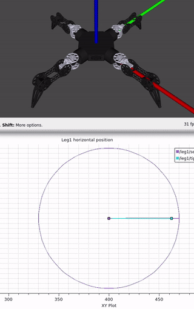

.. _api-label:
API
=======

I encourage you to dive into the source code and customize it to fit your robot’s unique needs. By importing the motion stack Python API into your own package and nodes, you keep customizations separate from the *core* motion stack while adapting it to each of your robot or robot module.

In this section, I’ll walk you through an example: creating a package to launch the Moonbot Zero with a different architecture and modifying the behavior of the nodes.

Make your package
-----------------

.. Note::
    Source ros2 before all those commands.

Go in your workspace's source:

.. code-block:: bash

    cd ~/Motion-Stack/src/

Create a package with a node named lvl1:

.. code-block:: bash

    ros2 pkg create --build-type ament_python --node-name lvl1 moonbot_zero

Open ``src/moonbot_zero/setup.py`` and change it like below. This will make available in the share sirectory:

    - All your .launch.py files in ``launch/`` , so ros2 can find them.
    - All your meshes/ and urdf/ available

.. code-block:: python
    :emphasize-lines: 2, 11
    :linenos:

    from setuptools import find_packages, setup
    from glob import glob # add this line

    package_name = 'moonbot_zero'

    setup(
        name=package_name,
        version='0.0.0',
        packages=find_packages(exclude=['test']),
        data_files=[
            (f"share/{package_name}/launch", glob("launch/*.py")),
            ('share/ament_index/resource_index/packages',
                ['resource/' + package_name]),
            ('share/' + package_name, ['package.xml']),
            ...

Create your own launcher in ``launch/`` of your new package:

.. code-block:: bash

    cd ~/Motion-Stack/src/moonbot_zero
    mkdir launch
    cd launch
    touch myrobot.launch.py

.. Note::

    For the provided executable to launch your new launcher, change ``~/Motion-Stack/launch_stack.bash`` like so:

    .. code-block:: bash

        ...
        ros2 launch moonbot_zero myrobot.launch.py MS_up_to_level:=4

    You can then launch and see your changes with ``bash launch_stack.bash``:

Using your URDF
---------------

Making a URDF available from your custom package
^^^^^^^^^^^^^^^^^^^^^^^^^^^^^^^^^^^^^^^^^^^^^^^^

In a ros package (here named *moonbot_zero*), create a ``urdf/`` and ``meshes/`` directories, then place you urdfs and meshes inside.

.. code-block:: bash

    cd ~/Motion-Stack/src/moonbot_zero
    mkdir meshes
    mkdir urdf

Make those directories available in the package shared directory by changing the ``setup.py``

.. code-block:: python
    :emphasize-lines: 9-10
    :linenos:

    ...

    setup(
        name=package_name,
        version='0.0.0',
        packages=find_packages(exclude=['test']),
        data_files=[
            (f"share/{package_name}/launch", glob("launch/*.py")),
            (f"share/{package_name}/urdf", glob("urdf/*", recursive=True)), # (this)
            (f"share/{package_name}/meshes", glob("meshes/*", recursive=True)), # (this)
            ]
        )

Make sure to adjust the paths of the urdf. ``<mesh filename="{SOMETHING}/base_link.stl" />`` should be ``<mesh filename="package://moonbot_zero/meshes/base_link.stl" />`` (where *moonbot_zero* is the name of the package).

Loading your URDF
^^^^^^^^^^^^^^^^^

Using the launch API in the next section, you can load a URDF by providing the package name and path. Assuming the package is *moonbot_zero* and the URDF is inside ``urdf/moonbot_zero.xacro``:

.. code-block:: python

    urdf_path=xacro_path_from_pkg(
        package_name="moonbot_zero",
        xacro_path="urdf/moonbot_zero.xacro",
    )

.. _launch-api-label:

Launch API
----------

To streamline the creation of numerous nodes, the :py:mod:`motion_stack.api.launch` provides a python launch API -- essentially wrapping around ROS2's launch system. The class :py:class:`.api.launch.builder.LevelBuilder` creates the nodes to be launched and its ultimate method :py:meth:`.api.launch.builder.LevelBuilder.make_description` returns the launch description used by ROS2.

Warming up
^^^^^^^^^^

Edit your ``myrobot.launch.py`` and let us start with the default launch provided by the motion stack:

.. code-block:: python

    from motion_stack.api.launch.builder import (
        LevelBuilder,
        xacro_path_from_pkg,
    )

    ROBOT_NAME = "moonbot_7"

    LEGS_DIC = {
        1: "end1",
        2: "end2",
        3: "end3",
        4: "end4",
    }

    lvl_builder = LevelBuilder(
        urdf_path=xacro_path_from_pkg(
            package_name="moonbot_zero", xacro_path="urdf/moonbot_zero.xacro"
        ),
        leg_dict=LEGS_DIC,
    )

    def generate_launch_description():
        return lvl_builder.make_description()

Changing params
^^^^^^^^^^^^^^^

.. code-block:: python

    ...
    new_params = {
        "std_movement_time": 10.0,
    }

    lvl_builder = LevelBuilder(
        urdf_path=xacro_path_from_pkg(
            package_name="moonbot_zero", xacro_path="urdf/moonbot_zero.xacro"
        ),
        leg_dict=LEGS_DIC,
        params_overwrite=new_params,
    )
    ...

After overwriting the ``std_movement_time`` parameter with 10 by passing it to the :py:class:`.LevelBuilder`, movements are very slow:

.. code-block:: bash

    ros2 service call /leg1/shift motion_stack_msgs/srv/TFService "{tf: {translation: {x: -100, y: 0, z: -100}, rotation: {x: 0.0, y: 0.0, z: 0.0, w: 1.0}}}"

Changing end effector and leg numbers
^^^^^^^^^^^^^^^^^^^^^^^^^^^^^^^^^^^^^

.. code-block:: python

    ...
    LEGS_DIC = {
        1: "end2",
        2: "end1",
        3: "end3",
        40: "end4",
    }
    ...

After changing the ``LEGS_DIC`` dictionary specifying which end effector correspond to each leg and passing it to :py:class:`.LevelBuilder`, leg2 is now the one at the front.

.. code-block:: bash

    ros2 service call /leg2/shift motion_stack_msgs/srv/TFService "{tf: {translation: {x: -100, y: 0, z: -100}, rotation: {x: 0.0, y: 0.0, z: 0.0, w: 1.0}}}"

And leg 40 is the one on the right:

.. code-block:: bash

    ros2 service call /leg40/shift motion_stack_msgs/srv/TFService "{tf: {translation: {x: 20, y: 50, z: -50}, rotation: {x: 0.0, y: 0.0, z: 0.0, w: 1.0}}}"

.. Note::

    Revert this back when you are done, otherwise you might get confused going further.

    .. code-block:: python

        LEGS_DIC = {1: "end1", 2: "end2", 3: "end3", 4: "end4"}

Overloading to have a single robot_state_publisher
^^^^^^^^^^^^^^^^^^^^^^^^^^^^^^^^^^^^^^^^^^^^^^^^^^

Looking at the default launching behavior, each leg has it own state publisher. This has limited usefulness for our Moobot Zero because this robot makes use of one centralized computer and not one computer per leg.

Let's change :py:meth:`.api.launch.LevelBuilder.state_publisher_lvl1` to centralize the state publishers in global namespace. Comparing below with the original source code, not much changed aside from one loop and a remapping.

.. code-block:: python

    ...
    from typing import Any, Dict, List, Mapping, Union
    from launch_ros.actions import Node
    from launch_ros.parameter_descriptions import ParameterValue
    from motion_stack.api.launch.builder import LevelBuilder, xacro_path_from_pkg
    from launch.substitutions import Command

    class MyLevelBuilder(LevelBuilder):
        def state_publisher_lvl1(self) -> List[Node]:
            compiled_xacro = Command([f"xacro ", self.xacro_path])
            node_list = []
            leg_namespaces = [f"leg{param['leg_number']}" for param in self.lvl1_params()]
            all_joint_read_topics = [f"{ns}/joint_read" for ns in leg_namespaces]
            node_list.append(
                Node(
                    package=self.MS_PACKAGE,
                    executable="lazy_joint_state_publisher",
                    name="lazy_joint_state_publisher",
                    # namespace=ns,
                    arguments=["--ros-args", "--log-level", "warn"],
                    parameters=[
                        {
                            "source_list": all_joint_read_topics,
                            "publish_default_positions": True,
                        }
                    ],
                    remappings=[
                        # (intside node, outside node),
                        ("joint_states", "continuous_joint_read"),
                    ],
                ),
            )
            node_list.append(
                Node(
                    package="robot_state_publisher",
                    executable="robot_state_publisher",
                    name="robot_state_publisher",
                    # namespace=ns,
                    arguments=["--ros-args", "--log-level", "warn"],
                    parameters=[
                        {
                            "robot_description": ParameterValue(
                                compiled_xacro, value_type=str
                            ),
                        }
                    ],
                    remappings=[
                        # (intside node, outside node),
                        ("joint_states", "continuous_joint_read"),
                    ],
                ),
            )
            return node_list
    ...

We created a new class ``MyLevelBuilder`` that inherits the behavior of ``LevelBuilder`` and overwrites the one method ``state_publisher_lvl1``. Now, when ``self.state_publisher_lvl1`` is called, one ``joint_state_publisher`` and ``robot_state_publisher`` is created in the global namespace listening to the list of topics ``[leg1/joint_read, leg2/joint_read, ...]``.

.. Note::

     \ ``lazy_joint_state_publisher`` is used, it is slightly different from the default ``joint_state_publisher``. See :py:class:`motion_stack.ros2.utils.lazy_joint_state_publisher.LazyJointStatePublisher`

Remapping
^^^^^^^^^

Notice in the previous example, "joint_states" topic is used differently by several nodes. They need to be remapped onto other name to avoid conflicts:

.. code-block:: python

    ...
        remappings=[
            # (intside node, outside node),
            ("joint_states", "continuous_joint_read"),
        ],
    ...

.. Note::

    Remapping and namespaces are the main way to avoid conflicts when building your modular system.

Automating modularity
^^^^^^^^^^^^^^^^^^^^^

Using python you can change the behavior of your launcher depending on where it is launch (on the robot brain, on leg #1, on leg #2, on any PC, on ground station, ...). There is no one good way to do it, so I will explain my method with a very basic example:

I define environment variables in the OS of the computer, then launch different nodes base on that. Again, overwrite :py:meth:`.api.launch.LevelBuilder.state_publisher_lvl1` to add such functionalities.

.. code-block:: python

    class MyLevelBuilder(LevelBuilder):
        def __init__(
            self,
            urdf_path: str,
            leg_dict: Mapping[int, Union[str, int]],
            params_overwrite: Dict[str, Any] = dict(),
            urdf: Union[None, str, Command] = None,
        ):
            # gets the "COMPUTER_ID" environement variable
            self.COMPUTER_ID = os.environ.get("COMPUTER_ID")
            if self.COMPUTER_ID in ["leg1", "leg2", "leg3", "leg4"]:
                # if running on one of the leg computer
                # we only start the assiciated leg/end-effector
                leg_number = int(self.COMPUTER_ID[-1])
                end_effector: Union[str, int, None] = leg_dict.get(leg_number)
                if end_effector is None:
                    raise Exception("leg number has no entry in leg_dict")
                reduced_leg_dict = {leg_number: end_effector}
                leg_dict = reduced_leg_dict
            super().__init__(urdf_path, leg_dict, params_overwrite, urdf)

        def make_levels(self) -> List[List[Node]]:
            if self.COMPUTER_ID in ["leg1", "leg2", "leg3", "leg4"]:
                # if running on one of the leg computer
                # we only start lvl1
                return [self.lvl1()]
            if self.COMPUTER_ID == "robot_brain":
                # if running on the main robot computer
                # we start lvl2-3-4
                return [self.lvl2(), self.lvl3(), self.lvl4()]
            if self.COMPUTER_ID == "ground_station":
                # if running on the ground station
                # we start only lvl5
                return [self.lvl5()]
            # if none of the previous cases, the default behavior runs everything
            return super().make_levels()

.. Note::

   This is not part of the tutorial, you do not need to make this work.

.. _own-node-label:

Loading you own node
^^^^^^^^^^^^^^^^^^^^

In the next section we will replace the default motion stack lvl1 node :py:class:`motion_stack.ros2.default_node.lvl1.DefaultLvl1` with our own modified node, from our package. We will make the launch API load our node instead of the default.

In your launcher overload :py:meth:`.LevelBuilder.get_node_lvl1` with:

.. code-block:: python
    :emphasize-lines: 5-8

    class MyLevelBuilder(LevelBuilder):
        def get_node_lvl1(self, params: Dict[str, Any]) -> Node:
            ns = f"leg{params['leg_number']}"
            return Node(
                package="moonbot_zero",
                namespace=ns,
                executable="lvl1",
                name=f"lvl1",
                arguments=["--ros-args", "--log-level", "info"],
                emulate_tty=True,
                output="screen",
                parameters=[params],
                remappings=self.remaplvl1,
            )

.. _lvl1-api-label:

Lvl1 specialization API
-----------------------

The Motion Stack low level python code is designed such that you can easily overload relevant part of the code and use it like an API in which you inject your code.

.. Note::

    After completing the previous step ":ref:`own-node-label`", modify your node ``src/moonbot_zero/moonbot_zero/lvl1.py``.

Overwriting
^^^^^^^^^^^

By importing the motion stack default node of lvl1 :py:class:`motion_stack.ros2.default_node.lvl1`, you can overwrite parts of it with the code you need.

The following example python file:
    - Overwrite :py:class:`.lvl1.DefaultLvl1`\ ``.__init__()`` to add a timer and publisher
    - Makes a new callback for the timer, moving each joint in a sinusoidal motion (this emulates a subscriber or something receiving data).
    - Overwrites :py:meth:`.DefaultLvl1.publish_to_lvl0`, it now also publishes every command on a string topic ``display_angle_command``.

.. literalinclude:: ../../../src/moonbot_zero_tuto/moonbot_zero_tuto/lvl1.py
   :linenos:
   :lines: 1-24, 42-
   :language: python

You can now listen to the motor commands of leg1 using:

.. code-block:: bash

   ros2 topic echo /leg1/display_angle_command

.. code-block:: console

   data: 'leg 1
      lvl1 -> lvl0: joint1_1 | 5.7
      lvl1 -> lvl0: joint1_2 | 5.7
      lvl1 -> lvl0: joint1_3 | 5.7'

Using the API and overloading like this, you can easily add functionalities to the motion stack without creating a new whole node, and with minimal knowledge of ros2. You can:

    - Change where the data is sent and how it is formatted (like we did with the string topic).
    - Change where the data comes from and its format (like we did with the timer, you can replace it with a subscriber).

Injection
^^^^^^^^^

Injection consists in instantiating an object that adds functionalities to a parent object.
Right now a few ready to use injections are available in :py:mod:`motion_stack.api.ros2` (their non-ros dependent and general injections are in :py:mod:`motion_stack.api.injection`).

    - :py:mod:`motion_stack.api.injection.remapper` : Remaps states names, and applies shaping functions to the state data. With this you can apply offsets, gains and more. (does not require ros)
    - :py:mod:`motion_stack.api.ros2.offsetter` : Adds angle offsets to the motor output of lvl1 at runtime (and a little bit more)
    - :py:mod:`motion_stack.api.ros2.state_to_topic` : Publishes on individual Float64 topics instead of a JointStates topic.

Let's use all 3\:

.. literalinclude:: ../../../src/moonbot_zero_tuto/moonbot_zero_tuto/lvl1.py
   :linenos:
   :emphasize-lines: 25-41
   :language: python

Running ``ros2 topic echo /leg1/display_angle_command`` you'll see that ``joint1-1`` is now ``my-new-joint``, and its value has been multiplied by 2.

.. code-block:: bash

    ros2 topic echo /leg1/display_angle_command

.. code-block:: console
   :emphasize-lines: 2

   data: 'leg 1
      lvl1 -> lvl0: my_new_joint | 11.4
      lvl1 -> lvl0: joint1_2 | 5.7
      lvl1 -> lvl0: joint1_3 | 5.7'

Running  ``ros2 topic list | grep .*/driver`` you'll see that topics have been created, publishing the positions of the joints.

.. code-block:: bash

    ros2 topic list | grep .*/driver

.. code-block:: console

    /leg1/driver/joint1_2/position
    /leg1/driver/joint1_3/position
    /leg1/driver/my_new_joint/position
    /leg2/driver/joint2_1/position
    /leg2/driver/joint2_2/position
    /leg2/driver/joint2_3/position
    /leg3/driver/joint3_1/position
    /leg3/driver/joint3_2/position
    /leg3/driver/joint3_3/position
    /leg4/driver/joint4_1/position
    /leg4/driver/joint4_2/position
    /leg4/driver/joint4_3/position

Running the code below, will add 1 radian to the output of joint1-2 (not in rviz, only on the lvl0 motor command output).

.. code-block:: bash

    ros2 service call /leg1/set_offset motion_stack_msgs/srv/SendJointState "{js: {name: [joint1_2], position: [1], velocity: [], effort: []}}"

.. code-block:: console
   :emphasize-lines: 3

   data: 'leg 1
      lvl1 -> lvl0: my_new_joint | -1.4
      lvl1 -> lvl0: joint1_2 | -58.0
      lvl1 -> lvl0: joint1_3 | -0.7'

High level API
--------------

.. Warning::

   This tutorial section is not finished, the in-code documentation is however available: :py:mod:`motion_stack.api.ros2`

High level APIs are available and meant to be used in your own ROS2 nodes. The API simplifies things, however you can also directly send messages onto the available ROS2 topics.

 - Joint API -- :py:mod:`.api.ros2.joint_api`: ROS2 API to send/receive joint command/state to lvl1 and synchronize multiple joints.
 - IK API -- :py:mod:`.api.ros2.ik_api`: ROS2 API to send/receive end-effector IK command / FK state to lvl2 and synchronize multiple limbs.

An example node using the high level API, doing some movements using the moonbot zero is available in ``src/moonbot_zero_tuto/moonbot_zero_tuto/high_level.py``. This node is specific to moonbot zero, however the apis used are not. Please take inspiration from it.

Launch the motion stack, Rviz and the tutorial node with the moonbot zero:

.. code-block:: bash

    bash launch_stack.bash

.. code-block:: bash

    bash launch_simu_rviz.bash  # (separate terminal)

.. code-block:: bash

    ros2 run moonbot_zero_tuto high_level  # (separate terminal)

.. literalinclude:: ../../../src/moonbot_zero_tuto/moonbot_zero_tuto/high_level.py
  :linenos:
  :language: python
